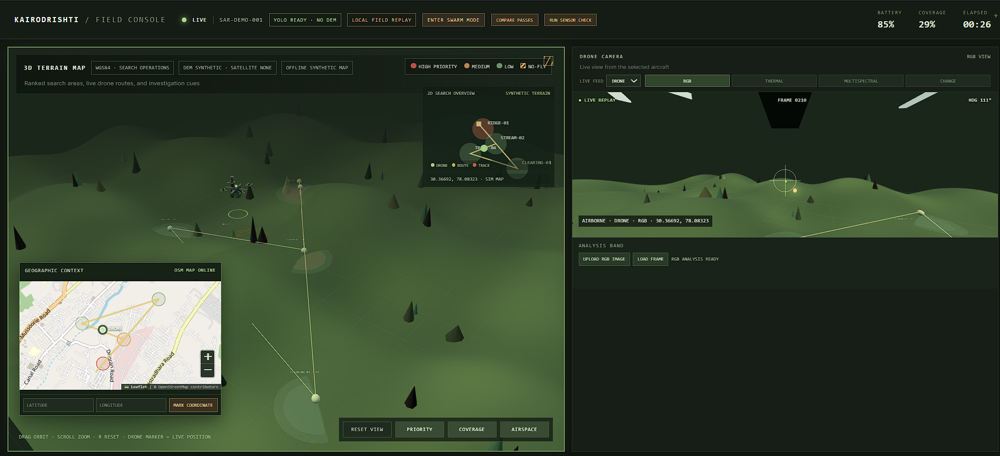

# KairoDrishti

## Search & Rescue Aerial Intelligence · PS #8

KairoDrishti helps rescue teams search difficult terrain faster. It turns aerial imagery into ranked search areas, investigation coordinates, safe routes, and field-ready waypoints.

## The five core solutions

1. **Detect** people and human signs: clothing, shelters, and tracks.
2. **Prioritise** search sectors using last known position, movement, terrain, visibility, and coverage.
3. **Plan** battery-aware routes with terrain clearance, no-fly zones, return-home reserve, and swarm sectors.
4. **Use more evidence** with RGB, thermal, multispectral, satellite, and change detection.
5. **Deliver action** as geolocated waypoints and GeoJSON, CSV, KML, or GPX field packets.

The system runs locally with cached data and local AI models. A detection is an investigation cue, not automatic survivor confirmation.

## Workflow

```text
Imagery → Detection → Evidence fusion → Priority sectors → Safe route → Rescue waypoint
```



## Dashboard screenshots

| View | What it shows |
| --- | --- |
| [Mission overview](docs/screenshots/dashboard-overview.png) | 3D terrain, route, map, and drone camera |
| [Detection and field output](docs/screenshots/detection-and-field-output.png) | Human-sign counts, candidate queue, and coordinates |
| [Swarm search](docs/screenshots/swarm-search.png) | Drone ownership, sectors, coverage, and battery |

[Open the compact technical architecture diagram](docs/architecture-overview.svg)

## Run locally

### 1. Install dependencies

```powershell
cd "C:\Users\kumar\OneDrive\Desktop\KairoDrishti\KairoDrishti"
python -m pip install -r requirements.txt
npm install
```

### 2. Start the API

Basic offline mode:

```powershell
python -m app.server
```

YOLO mode with person/terrain and clothing models:

```powershell
py -3.11 -m pip install ultralytics
py -3.11 -m app.server `
  --detector yolo `
  --yolo-model ".\datasets\weights\best.pt" `
  --clothing-model "C:\Users\kumar\Downloads\best.pt" `
  --device cpu
```

### 3. Start the dashboard

Open a second terminal:

```powershell
cd "C:\Users\kumar\OneDrive\Desktop\KairoDrishti\KairoDrishti"
npm run dev
```

Open `http://127.0.0.1:5173`.

For the compiled dashboard:

```powershell
npm run build
python -m app.server
```

Open `http://127.0.0.1:8765`.

## Demo flow

1. Start the mission and show the ranked route.
2. Upload an RGB aerial image.
3. Show PEOPLE, CLOTHING, SHELTERS, and TRACKS counters.
4. Review the candidate confidence and source sensor.
5. Show the latitude/longitude on the map.
6. Select **INVESTIGATE COORDINATE**.
7. Export a GeoJSON or GPX field packet.
8. Show thermal, change detection, or swarm mode.

## Technical approach

| Layer | Implementation |
| --- | --- |
| Detection | Local YOLO models plus OpenCV fallback |
| Sensors | RGB, thermal, multispectral, satellite, successive passes |
| Intelligence | Evidence fusion, confidence, taxonomy, nearest-decay tracks |
| Planning | Priority scoring, battery constraints, DEM clearance, A*, no-fly zones |
| Swarm | Sector assignment, separation, coverage, battery state |
| Dashboard | Three.js terrain, Leaflet map, live camera, candidate queue |
| Output | Geolocated waypoints and GeoJSON/CSV/KML/GPX |

## Useful API routes

```text
GET  /api/mission
GET  /api/terrain
GET  /api/readiness
POST /api/frames/detect
POST /api/change-detection
POST /api/terrain/load
POST /api/swarm/init
GET  /api/swarm
GET  /api/mission/export?format=geojson
```

## Data support

- Local SRTM `.hgt`, GeoTIFF, and COG DEM files
- RGB `.png`, `.jpg`, `.jpeg`, and `.npy` frames
- Thermal `.png`, `.jpg`, and `.npy` data
- Multispectral `.npy` arrays
- Successive-pass imagery for change detection
- Optional OpenStreetMap geographic context with offline fallback

## Validation

```powershell
npm run build
npm run test:e2e
python -m pytest
```

The prototype is a local decision-support and planning console. Its aircraft movement and camera are simulated replay visuals; it does not directly control or launch a real aircraft.

## Research references

- [YOLO: Unified Real-Time Object Detection](https://arxiv.org/abs/1506.02640)
- [Ultralytics YOLO documentation](https://docs.ultralytics.com/)
- [HIT-UAV thermal aerial dataset](https://arxiv.org/abs/2204.03245)
- [ESA Sentinel-2 multispectral instrument](https://www.esa.int/Applications/Observing_the_Earth/Copernicus/Sentinel-2/Instrument)
- [USGS SRTM elevation data](https://www.usgs.gov/centers/eros/science/usgs-eros-archive-digital-elevation-shuttle-radar-topography-mission-srtm)
- [UAV search-and-rescue coverage planning](https://www.sciencedirect.com/science/article/pii/S0305054824002946)
- [ORB feature matching](https://ieeexplore.ieee.org/document/6126544)
- [Kalman filtering](https://doi.org/10.1115/1.3662552)
- [OpenStreetMap tile usage policy](https://operations.osmfoundation.org/policies/tiles/)

## Project layout

```text
app/server.py                 local Python API
engine/search_rescue/         detection, tracking, planning, export
frontend/src/                 Three.js + Leaflet dashboard
tests/unit/                   engine and API tests
tests/e2e/                    dashboard tests
docs/                         architecture and screenshots
```
